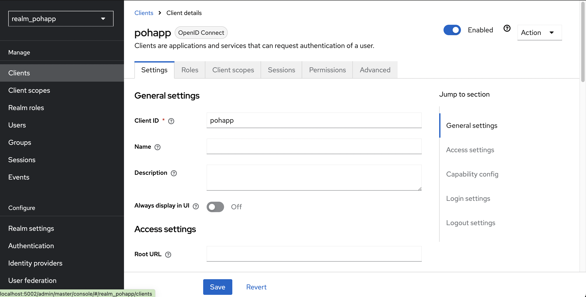
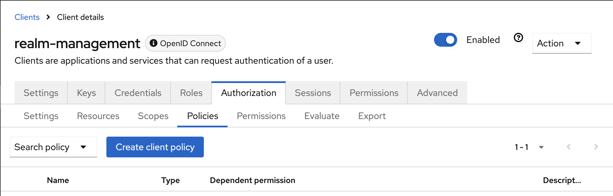

# Pasos iniciales
## Importar todas las dependencias

- Abrir la terminal:
- Ejecutar:   ```flutter pub get```

## Crear el contenedor docker

- Abrir la terminal y acceda al directorio docker:
```cd docker```
- Ejecutar:   ```docker-compose up```

## Crear proyecto Firebase
- [Web Firebase](https://firebase.google.com)

Para generar el SHA-1 que es la clave o huella que necesita firebase puedes hacer lo siguiente:

- Abrir la terminal y acceder al directorio android ```cd android```
- Ejecutar el comando ```./gradlew signingReport```

Una vez culminada la creacion de la configuracion de la misma se veria de esta manera 

<p align="center">
    
</p>

## Configurar keycloak

Estos pasos son un poco extensos pero tratare de resumirlos.
- Acceder a la consola de administracion y logearse

[Consola de administracion](http://localhost:5002)

- Crear un reino, en mi caso cree ```realm_pohapp```
<p align="center">
    
</p>

- Crear un Cliente, en mi caso ```pohapp```
<p align="center">
    
</p>
Las configuraciones de de acceso y redirect los deje inicialmente en todos *
<p align="center">
    
</p>

El resto se mantiene igual

- Acceder a Identify providers
<p align="center">
    
</p>

Seleccionar la opcion de google

Se les completara automaticamente el Redirect Uri
Deberan rellenar los campos de ```Client ID``` y ```Client Secret``` con los datos provedidos por el proyecto Firebase
<p align="center">
    
</p>

Mas abajo en el item ```Scope``` completamos con ```email profile openid```

Posteriormente guardamos cambios

Y accedemos a la pestaña de Permissions
<p align="center">
    
</p>
 Y habilitamos Permissions

 En Permissions list abrimos la ruta ```token-exchange```
<p align="center">
    
</p>

Desde alli accederemos a Client details como se ve marcada en la imagen
<p align="center">
    
</p>

Desde alli accedemos a la pestaña Policies o politicas y creamos una 
<p align="center">
    
</p>

Le agregamos un nombre y seleccionamos nuestro Cliente en mi caso pohapp

Logic ```Positive```

Le damos a guardar y volvemos a Identify Providers

<p align="center">
    
</p>

Abrimos nuestra configuracion ```google```, la pestaña ```Permissions```, la ruta ```token-exchange``` 

<p align="center">
    
</p>
Seleccionamos la politica que creamos 
<p align="center">
    
</p>

Guardamos y tenemos lista la configuracion del keycloak.

## Configuracion de la app Flutter

Abrimos el main y ajustamos las rutas a nuestro keycloak con la ip de nuestro proyecto local o el host de nuestro servidor 

<p align="center">
    
</p>
